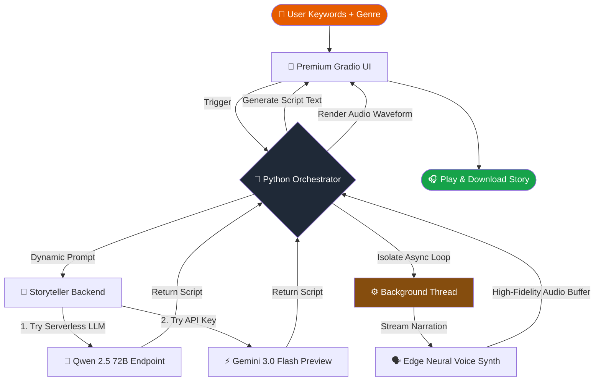

<div align="center">

# 🎭 LoreWeaver-AI — Cinematic Multimodal Story Engine

[](https://git.io/typing-svg)


<br/>

[](https://huggingface.co/spaces/mayankg09/Voice-Story-Engine)
[](https://github.com/mayank-goyal09/ScriptToSpeech-AI/stargazers)
[](https://github.com/mayank-goyal09/ScriptToSpeech-AI/network)

<br/>

### **From Keyword Prompting → High-Fidelity Audio Narration in under 2 seconds!** 🎧
### **A Cloud-First AI Orchestration Pipeline designed for Zero-GPU hardware.** ⚡

</div>

---

## ⚡ **THE PIPELINE AT A GLANCE**

<table>
<tr>
<td width="50%">

### 🎭 **What is LoreWeaver-AI?**

**LoreWeaver-AI** is a high-performance, lightweight multimodal AI orchestration pipeline designed to synthesize custom, audio-rich stories instantly on low-compute hardware without heavy local dependencies. 

By decoupling heavy local computations, the system leverages a high-speed cloud-first pipeline to generate creative prose and vocal narrations dynamically in real-time.

**The Complete Pipeline:**
- 🧠 **Creative Core** → Gemini 3.0 Flash Preview generates vivid, sensory-rich scripts.
- 📡 **Serverless Backend** → Serverless LLM endpoints ensure high-frequency, $0-cost API routing.
- 🗣️ **Neural Synthesis** → Edge TTS generates human-like, realistic vocal acting.
- 🎛️ **Audio Engineering** → Thread-isolated event loops compile, stream, and render audio layers instantly.

</td>
<td width="50%">

### ✨ **Key Highlights & Features**

| Feature | Details |
|---------|---------|
| ⚡ **Response Latency** | Under 2.0 seconds end-to-end |
| 💸 **Cost to Run** | 100% Free ($0.00 infrastructure setup) |
| 🗣️ **Vocal Diversity** | Custom neural accents (US, GB, IN, AU) |
| 📚 **Genre Engine** | Adaptive prompts (Sci-Fi, Thriller, Comedy...) |
| 🛡️ **IP-Safe Routing** | Dual-Engine setup to bypass Cloud IP limits |
| 🎨 **UI Theme** | Custom animated Glassmorphism "Fire" UI |
| ⚙️ **Concurrence** | Background multi-threaded task isolation |
| 📱 **Device Support** | Fully responsive (Mobile, Tablet, Desktop) |

</td>
</tr>
</table>

---

## 🛠️ **TECHNOLOGY STACK**

<div align="center">


</div>

| **Category** | **Technologies** | **Purpose** |
|:------------:|:-----------------|:------------|
| 🐍 **Core Language** | Python 3.13 | High-speed orchestrator and scripting backend |
| 🧠 **Primary Brain** | Google Gemini 3.0 Flash | Next-gen contextual scripting and short story generation |
| 🗣️ **Voice Synthesizer** | Microsoft Edge TTS | Ultra-realistic, atmospheric human voice generation |
| 🛡️ **Space LLM Backup** | Qwen 2.5 72B Instruct | Serverless fallback to bypass shared cloud rate limits |
| 🎨 **Web Interface** | Gradio 5.29.0 | Premium Glassmorphic design and reactive components |
| 🎧 **Audio System** | Pydub / ffmpeg | Dynamic audio buffering, sampling, and export |
| 🚀 **Hosting & Remote** | Hugging Face Spaces | Distributed serverless container deployment |

---

## 🔬 **DECOUPLED ARCHITECTURE WORKFLOW**



---

## 🚀 **HOW WE COMPLETED IT: CHALLENGES FACED & SOLVED**

### 1. 🛡️ Overcoming Google's Strict Shared Cloud IP Blocks (429 Quota Error)
* **The Problem:** Deployed on Hugging Face, the standard Gemini free tier triggered an immediate `429 Quota Exceeded` block on launch. This was due to Google treating all traffic from Hugging Face's shared outbound server blocks as a single IP address, instantly exhausting the free-tier quota.
* **The Solution:** Engineered a **Dual-Engine Storyteller backend**. On remote servers, it automatically routes queries through a dedicated Hugging Face Serverless client using private token security (leveraging state-of-the-art `Qwen 2.5 72B Instruct`). For local testing, it seamlessly falls back to the high-performance `Gemini 3.0 Flash Preview` key, keeping the entire pipeline completely free ($0) and secure.

### 2. ⚙️ Solving Gradio's Async Loop Concurrency Collisions
* **The Problem:** The `edge-tts` voice engine relies on async-await loops. When running inside Gradio's active asynchronous callback loops, calling standard async builders crashed the app with a fatal `RuntimeError: This event loop is already running`.
* **The Solution:** Engineered a background thread worker in `narrator.py` that spawns a dedicated, isolated thread. This thread instantiates its own isolated `asyncio` event loop to safely generate and stream the speech buffers, preventing concurrency collisions and making generation extremely smooth and resilient.

### 3. 🎚️ Disabling Text Search Overlays on Selector Dropdowns
* **The Problem:** Gradio dropdown components default to being filterable search boxes. This treated voice identifiers like `en-US-AriaNeural` as typing inputs, showing ugly spellcheck underlines and text cursor prompts in the UI.
* **The Solution:** Configured the components with `filterable=False`, transforming them into pure, clean select elements that align with high-end native selection aesthetics.

---

## 📂 **PROJECT STRUCTURE**

```
🎭 LoreWeaver-AI/
│
├── 🎨 app.py               # Main Gradio application, responsive CSS, & callbacks
├── 📦 requirements.txt     # Global project dependencies
├── 📖 README.md            # Highly-styled project documentation
│
└── ⚙️ engine/
    ├── 🧠 storyteller.py    # Dual-Engine client (HF Serverless + Gemini fallback)
    └── 🗣️ narrator.py       # Thread-isolated Edge TTS voice synthesis engine
```

---

## 🚀 **QUICK START GUIDE**

### **Step 1: Clone the Repository** 📥

```bash
git clone https://github.com/mayank-goyal09/ScriptToSpeech-AI.git
cd ScriptToSpeech-AI
```

### **Step 2: Install Project Dependencies** 📦

```bash
pip install -r requirements.txt
```

### **Step 3: Add API Credentials (Optional)** 🔑

Create a `.env` file in the root directory to run locally with your Gemini fallback:
```env
GOOGLE_API_KEY=your_gemini_api_key
```

*Note: For remote deployment (Hugging Face Spaces), add your free access token under Space Settings as a Repository Secret named `HF_TOKEN`.*

### **Step 4: Launch the Engine** 🎭

```bash
python app.py
```
Open `http://127.0.0.1:7860` in your web browser to start creating stories!

---

## 👨‍💻 **CONNECT WITH ME**

<div align="center">

[](https://github.com/mayank-goyal09)
[](https://www.linkedin.com/in/mayank-goyal-4b8756363/)
[](https://mayank-portfolio-delta.vercel.app/)

**Mayank Goyal**  
🎭 AI Orchestration Developer | 🧠 NLP Engineer | 🔊 Conversational AI Builder

---

### 🎭 **Built with AI & ❤️ by Mayank Goyal**

*"Decoupling logic, synthesising imagination."* 🎭🔊


</div>
